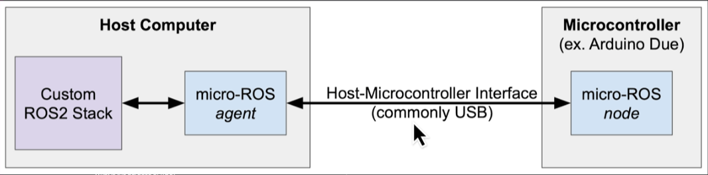

# **ROS2 Humble install on RaspberryPi4**

The procedure is:
- Install Ubuntu22.04 server (64bits) image using "Pi Imager"
- connect using SSH
- Install ubuntu-desktop
- Install ros2 Humble

You can follow the instructions on:
- https://roboticsbackend.com/install-ubuntu-on-raspberry-pi-without-monitor/
- https://roboticsbackend.com/install-ros2-on-raspberry-pi/
- https://github.com/ros-realtime/ros-realtime-rpi4-image

Make sure you have selected:
- user: pi
- Pass: 1234

Connect to the rbpi4:
- remotelly with SSH
```shell
cmd
ssh pi@192.168.54.219
```
- With screen and keyboard

    - Sometimes when you connect a USB the screen service is corrupted. Then reestart the service from the remote connection:
    ```shell
    sudo service gdm3 restart
    ```

## 1. **microROS Installation**

Follow instructions in:
- https://www.udemy.com/course/ros2-for-beginners-build-your-first-robot-with-esp32/learn/lecture/39333626?start=45#overview

Official links:
- uROS official website: https://micro.ros.org/docs/overview/features/
- uROS arduino library: https://github.com/micro-ROS/micro_ros_arduino
- Setup ESP32 in arduino IDE: https://randomnerdtutorials.com/installing-the-esp32-board-in-arduino-ide-windows-instructions/
- uROS agent: https://github.com/micro-ROS/micro-ROS-Agent
- Install ROS dependencies: https://wiki.ros.org/rosdep




uROS for Arduino supports ESP32, for that we will have to:
- Install arduino in rbpi4 board:
```shell
sudo snap install arduino
```
- Install on arduino IDE the ESP32 board from Espressif Systems version 2.0.2
- Connect ESP32 board
- Add arduino uROS libraries