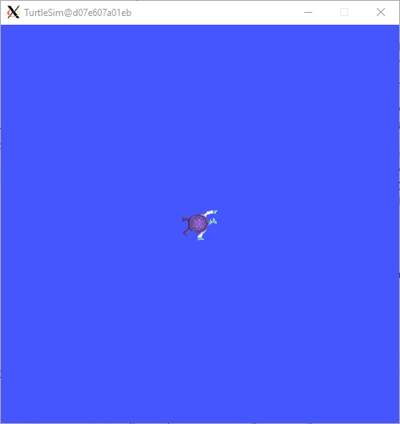

# **Practice ROS2 with Turtlesim**

In this section we will practice the ROS2 concepts and different performances:
- Turtlesim environment
- Turtlesim control with a joystick (linebot)
- Turtlesim follow-me project: https://www.udemy.com/course/ros2-for-beginners/learn/lecture/21306698?start=1#overview

## **1. Turtlesim environment**

Turtlesim is a package that contains a 2D turtle robot simulation and is a good opportunity to apply what we have learnes of ROS2 in the previous chapter.

We will start with the main turtlesim node with:
```shell
ros2 run turtlesim turtlesim_node
```


We can verify the nodes:
```shell
ros2 node list
```
We will start another node to control the turtlesim robot
```shell
ros2 run turtlesim turtle_teleop_key
```
## **. Turtlesim “Catch Them All” project**

Time to start your first complete project with ROS2!

For this project you will use the Turtlesim package as a simulation tool, so you can visualize what the robot is doing.

Make sure you've watched the previous video to see what you'll get at the end of this project.