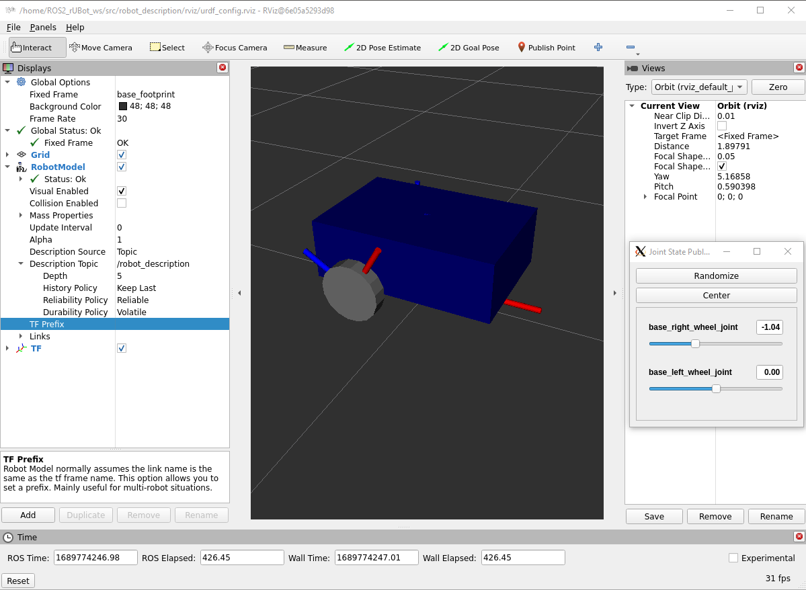

## **2. ROS2 rUBot model and Control**
The objective of this section is to simulate the rUBot behaviour in virtual environment.

The objectives of this section are:
- Create a new "robot_description" package with 
- Create a complete robot model
- Spawn the robot model in a proper virtual world in gazebo environment

A very good guide is deescribed in: https://www.udemy.com/course/ros2-tf-urdf-rviz-gazebo/learn/lecture/38688920#overview

### **2.1. Create a new "robot_description" package**
To create this package, type:
```shell
ros2 pkg create robot_description
```
Now proceed with the following instructions:
- remove "src" and "include" folders
- add "urdf", "launch" and "rviz" folders
- place the robot model in urdf folder
- Install the urdf, launch and rviz folders modifying the "CMakeList.txt" file:
```shell
cmake_minimum_required(VERSION 3.8)
project(robot_description)

if(CMAKE_COMPILER_IS_GNUCXX OR CMAKE_CXX_COMPILER_ID MATCHES "Clang")
  add_compile_options(-Wall -Wextra -Wpedantic)
endif()

# find dependencies
find_package(ament_cmake REQUIRED)

install(
  DIRECTORY urdf launch rviz
  DESTINATION share/${PROJECT_NAME}/
)

ament_package()
```
- move to the ws and compile again
- You can see the installed directories in "~/ROS2_rUBot_ws/install/robot_description/share/robot_description/" folders

Now everything is ready to create the **launch file**. This can be done in python but also in xml. We will do in xml language for simplicity and better understanding.
- verify "launch" folder is created and CMakeList.txt is created properly
- create a new file "display.launch.xml" inside
- compile again
- source install/setup.bash
- Launch:
```shell
ros2 launch robot_description display.launch.xml
```
- Configure the rviz with:
    - Fixed frame to "base_footprint"
    - add "RobotModel"
    - select the robot Description topic to /robot_description
    - add TFs
- save config to rviz folder as "urdf_config.rviz"

> Perhaps you will have to install:
>
>sudo apt install ros-humble-joint-state-publisher-gui



The same launch file can be done in python. You can see the syntax in "display.launch,py" file in "launch" folder.
- compile the ws
- open a new terminal and type
```shell
roslaunch robot_description display.launch.py
```
>You will see the same as before

### **2.2. Create a robot model**

A first "my_robot.urdf" file is delivered to display a first robot model in rviz program.

For a more complete robot model, it is suggested to use xacro format. This format will help you to better organize and scale your model with more functionalities.

The gazebo functionalities are defined with plugins:
- https://classic.gazebosim.org/tutorials?tut=ros_gzplugins
- https://github.com/ros-simulation/gazebo_ros_pkgs/tree/ros2/gazebo_plugins/include/gazebo_plugins

If you are using OpenCV, the frame used for the camera has a different orientation and you have to add a new link. This is explained and solved in:
- https://answers.ros.org/question/232534/gazebo-camera-frame-is-inconsistent-with-rviz-opencv-convention/

The complete "my_robot.urdf.xacro" is composed by different files:
- my_robot.urdf.xacro (the main one)
- mobile_base.xacro (with links and joints)
- common_properties.xacro (with material and inertia properties)
- mobile_base_gazebo.xacro (with differential_drive gazebo plugin)
- camera.xacro (with camera plugin)

The robot model defined in xacro format, can be displayed using the same launch files, you have only to change the name of robot model to "my_robot.urdf.xacro", in launch file:
```xml
...
<let name="urdf_path" 
     value="$(find-pkg-share robot_description)/urdf/my_robot.urdf.xacro" />
...
```

### **2.3. Create a new robot_bringup package**

This is usually made to spawn the robot model in a proper virtual world in gazebo environment.

Let's follow similar steps as previous section for robot_description package:
- Create a new package:
```shell
ros2 pkg create robot_bringup
```
- remove "src" and "include" folders
- add "launch" "rviz" "worlds" folders
- Install the folders modifying the "CMakeList.txt" file:
```shell
cmake_minimum_required(VERSION 3.8)
project(robot_bringup)

if(CMAKE_COMPILER_IS_GNUCXX OR CMAKE_CXX_COMPILER_ID MATCHES "Clang")
  add_compile_options(-Wall -Wextra -Wpedantic)
endif()

# find dependencies
find_package(ament_cmake REQUIRED)

install(
  DIRECTORY launch rviz worlds
  DESTINATION share/${PROJECT_NAME}/
)

ament_package()
```
- create a new "my_robot_gazebo.launch.xml"
```xml
<launch>
    <let name="urdf_path" 
         value="$(find-pkg-share robot_description)/urdf/my_robot.urdf.xacro" />
    <let name="rviz_config_path"
         value="$(find-pkg-share robot_bringup)/rviz/urdf_config.rviz" />

    <node pkg="robot_state_publisher" exec="robot_state_publisher">
        <param name="robot_description"
               value="$(command 'xacro $(var urdf_path)')" />
    </node>

    <include file="$(find-pkg-share gazebo_ros)/launch/gazebo.launch.py">
     <arg name="world" value="$(find-pkg-share robot_bringup)/worlds/test_world.world" />
    </include>

    <node pkg="gazebo_ros" exec="spawn_entity.py"
          args="-topic robot_description -entity my_robot" />

    <node pkg="rviz2" exec="rviz2" output="screen" 
          args="-d $(var rviz_config_path)" />
</launch>
```
- Because of we have used other packages, these have to be included in "package.xml" file:
```xml
...
  <exec_depend>robot_description</exec_depend>
  <exec_depend>robot_state_publisher</exec_depend>
  <exec_depend>gazebo_ros</exec_depend>
...
```
- Now you can compile again
```shell
colcon build
```
**Here!**


- provide the path to these new folders. This can be done in setup.py file. We have to add some lines at the begining to import some libraries and specify the folder paths:
```python
from setuptools import setup
import os
from glob import glob 
package_name = 'rover'

setup(
    name=package_name,
    version='0.0.0',
    packages=[package_name],
    data_files=[
        ('share/ament_index/resource_index/packages',
            ['resource/' + package_name]),
        ('share/' + package_name, ['package.xml']),
        (os.path.join('share', package_name), glob('launch/*.py')),
        (os.path.join('share', package_name), glob('urdf/*')),
        
    ],
...
```
- Add urdf models for different robots and save them in urdf folder
- In launch folder add files to print the robot models in rviz and gazebo. Use the following templates:
- for rover_rviz.launch.py:
```python
import os
from ament_index_python.packages import get_package_share_directory
from launch import LaunchDescription
from launch_ros.actions import Node

def generate_launch_description():
    package_dir = get_package_share_directory('mr_rehri')
    urdf = os.path.join(package_dir,'1_rover.urdf')
    rviz_config_file=os.path.join(package_dir,'config.rviz')

    return LaunchDescription([
        Node(
            package='robot_state_publisher',
            executable='robot_state_publisher',
            name='robot_state_publisher',
            output='screen',
            arguments=[urdf]),
        Node(
            package='joint_state_publisher_gui',
            executable='joint_state_publisher_gui',
            name='joint_state_publisher_gui',
            arguments=[urdf]),

        Node(
        package='rviz2',
        executable='rviz2',
        name='rviz2',
        arguments=['-d',rviz_config_file],
        output='screen'),
    ])
```
- for rover_gazebo_spawn.launch.py
```python
import os
from ament_index_python.packages import get_package_share_directory
from launch import LaunchDescription
from launch.actions import DeclareLaunchArgument, ExecuteProcess
from launch.substitutions import LaunchConfiguration
from launch_ros.actions import Node
from launch.launch_description_sources import PythonLaunchDescriptionSource

def generate_launch_description():
  urdf = os.path.join(get_package_share_directory('mr_rehri'),'1_rover.urdf')
  return LaunchDescription([
    #   publishes TF for links of the robot without joints
        Node(
            package='robot_state_publisher',
            executable='robot_state_publisher',
            name='robot_state_publisher',
            output='screen',
            arguments=[urdf]),
    #  To publish tf for Joints only links
        Node(
            package='joint_state_publisher',
            executable='joint_state_publisher',
            name='joint_state_publisher',
            output='screen',
            ),
#  Gazebo related stuff required to launch the robot in simulation
        ExecuteProcess(
            cmd=['gazebo', '--verbose', '-s', 'libgazebo_ros_factory.so'],
            output='screen'),
        Node(
            package='gazebo_ros',
            executable='spawn_entity.py',
            name='urdf_spawner',
            output='screen',
            arguments=["-topic", "/robot_description", "-entity", "dolly"])
  ])
```
- Be sure to have installed the needed packages:
```shell
sudo apt install ros-humble-joint-state-publisher
sudo apt install ros-humble-joint-state-publisher-gui
sudo apt install ros-humble-robot-state-publisher
sudo apt install ros-humble-gazebo-ros-pkgs
```


- compile the final package

Now you can launch the rover in rviz and gazebo
```shell
ros2 launch rubot_description rover_rviz.launch.py
```
See exemples: https://github.com/ros-controls/ros2_control_demos

### **Open URDF model from Gazebo Garden**

Open Gazebo
```shell
gz sim empty.sdf

gz service -s /world/empty/create --reqtype gz.msgs.EntityFactory --reptype gz.msgs.Boolean --timeout 1000 --req 'sdf_filename: "/home/ROS2_rUBot_ws/src/rubot_description/urdf/gopigo3ydmpuig.urdf", name: "gopigo3"'

### **2.2. ROS2 rUBot control**
The objectives of this section are:
- Create a new "rubot_control" package  
- Create ROS2 programs to control the robot to:
    - move with teleop keyboard
    - move with joy
    - move with speciffic node
    - obstacle avoidance
    - wall follower
    - line follower
#### **2.2.1. Create a new "rubot_control" package**
To create this package, type:
```shell
ros2 pkg create --build-type ament_python rubot_control --dependencies rclpy
```
Now proceed with the following instructions:
- add "launch" folder